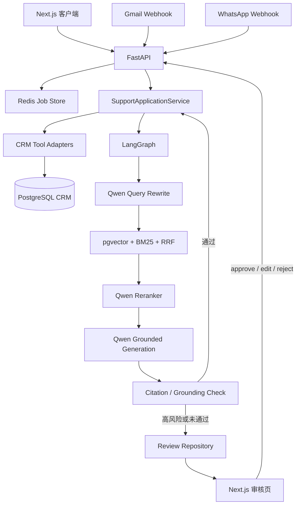

# GroundDesk AI

GroundDesk AI 是一个面向 SaaS 场景的全栈智能客服项目。它基于开源项目 [jawwad-ali/ai-customer-support-agent](https://github.com/jawwad-ali/ai-customer-support-agent) 改造，用于秋招项目实践和面试展示。

当前主链路已经从“模型自主调用 11 个工具”升级为可测试、可评测的 LangGraph 工作流：客户请求先写入 CRM，再经过 Query Rewrite、Hybrid Retrieval、Qwen Grounded Generation 和确定性 Citation 校验；高风险、低置信度或依据不足的回答进入独立人工审核，不会把未审核草稿展示给客户。

## 30 秒项目介绍

> GroundDesk AI 是一个支持 Web、Gmail 和 WhatsApp 入站的 AI 客服系统。FastAPI 接收请求并创建异步任务，Application Service 负责客户、工单、会话和消息的一致业务流程；LangGraph 对问题做改写，通过 pgvector 与 BM25 混合检索知识库，再由 Qwen 生成带引用回答。系统会确定性校验引用，并把退款、法律、删除账户、低置信度和无依据问题转入人工审核。PostgreSQL 是 CRM 和向量库，Redis 保存任务、检索缓存和审核索引，Next.js 同时提供客户页面与审核页面。项目还包含 30 条 Agent Eval，以及 30 条 v1 / 300 条 v2 Retrieval Eval，可量化检索、Grounding、升级路由和延迟。

## 当前架构



依赖方向遵守：

```text
web -> api -> agent/application -> retrieval/tools -> infrastructure
```

FastAPI 只负责传输模型、状态映射和后台任务；业务持久化集中在 Application Service；模型与数据库只在服务端初始化。

## 两条核心流程

### 自动回答

```text
POST /api/chat
→ 创建 run_id/job_id
→ find_or_create_customer
→ create_ticket + conversation
→ 保存 inbound message
→ ticket: open -> in_progress
→ Query Rewrite（失败回退原问题）
→ Vector + BM25 + RRF + Reranker
→ Qwen 生成 answer + citation_document_ids
→ Citation/Grounding 校验通过
→ send_response 保存 outbound message
→ ticket: resolved
→ 客户轮询取得回答和引用
```

### 人工审核

```text
高风险 / 低置信度 / 无检索结果 / 引用校验失败
→ Graph interrupt
→ 工单 escalated
→ Review Repository 保存内部草稿和真实业务 ID
→ 客户轮询只得到 waiting_review，response=null
→ 审核页 approve / edit / reject
→ edit 再次校验 Citation marker
→ approve/edit 只交付一次最终回答
→ 客户轮询取得 completed 或 rejected
```

审核详情可以查看草稿；客户 API 和客户页面不能看到未批准草稿。

## 核心技术点

### 1. Hybrid Retrieval

生产检索不再只依赖单一路径：

1. `text-embedding-v4` 生成固定 1536 维向量；
2. pgvector 做语义召回，BM25 做关键词召回；
3. Reciprocal Rank Fusion 合并不可直接比较的分数；
4. Qwen 对候选集 Rerank，超时或异常时安全降级到 RRF 顺序；
5. Top-1 Vector 分数低于经 Retrieval Eval 校准的 `0.40` 时标记低置信度。

Embedding 维度是数据库、配置和运行时共同约束；更换模型前必须制定全量知识库重建方案。

### 2. Grounded Generation

Generation 最多接收 Top 3 文档，每篇最多 2000 字符。模型必须返回结构化的 `answer` 和 `citation_document_ids`。Graph 会检查：

- 检索结果非空；
- 引用 ID 存在且属于本次最终检索集合；
- 引用 ID 不重复；
- 模型报告 ID、公开 Citation 与回答中的 `[n]` marker 集合一致。

任一条件失败都不能自动交付。当前校验能保证引用闭合，但不能替代逐事实语义核验。

### 3. 业务一致性

`SupportApplicationService` 在 Graph 前准备真实 `customer_id`、`ticket_id` 和 `conversation_id`，在 Graph 后交付或升级。它通过 Adapter 复用原项目的 11 个数据库工具，不在 API 或 Graph 节点中复制 SQL。

旧 OpenAI Agents SDK Runner 仍作为兼容回退保留，但正常生产组合使用 LangGraph 主链路。

### 4. 状态与 ID 契约

| 字段 | 含义 |
|---|---|
| `run_id` | Graph 运行和审核主键 |
| `job_id` | 异步轮询兼容字段，当前等于 `run_id` |
| `correlation_id` | 日志追踪 ID，首次请求时等于 `run_id` |
| `ticket_id` | PostgreSQL 真实工单 ID |
| `conversation_id` | PostgreSQL 真实会话 ID |

状态转换：

```text
processing -> completed
processing -> waiting_review
processing -> failed
waiting_review -> completed
waiting_review -> rejected
waiting_review -> failed
```

审核操作具有顺序幂等语义：相同终态动作返回已有结果，冲突动作返回 `409`，避免重复保存出站消息。

## 项目结构

```text
GroundDesk-AI/
├── agent/
│   ├── application/        # CRM 业务编排和工具 Adapter
│   ├── nodes/              # Query Rewrite / Answer Generation
│   ├── retrieval/          # Vector / BM25 / RRF / Reranker / Cache
│   ├── review/             # Review 模型与 Redis/InMemory Repository
│   ├── tools/              # 原项目 11 个安全数据库工具
│   ├── graph.py            # LangGraph 拓扑、Grounding、interrupt/resume
│   └── state.py            # SupportState 公共契约
├── api/main.py             # FastAPI 薄层
├── web/                    # Next.js 客户页面和 /reviews 审核页面
├── database/               # PostgreSQL schema、pgvector 和种子脚本
├── evals/                  # Retrieval Eval + Agent Eval
├── tests/                  # 后端自动化测试
├── docs/                   # 分阶段计划、报告和设计文档
├── .agent-harness/         # 架构/安全/RAG/协作规则
└── scripts/harness/        # 统一质量门禁
```

## 本地启动

### 前置条件

- Python 3.12+
- Node.js 20.19+
- PostgreSQL 16 + pgvector
- Redis 7
- Docker Compose（推荐）

### Docker Compose

```bash
cp .env.example .env
# 填写 DASHSCOPE_API_KEY 和 DASHSCOPE_BASE_URL
docker compose up --build
```

- Web：`http://localhost:3000`
- Review：`http://localhost:3000/reviews`
- API：`http://localhost:8000`
- OpenAPI：`http://localhost:8000/docs`

### 手动启动

```bash
python -m venv .venv
source .venv/bin/activate
pip install -e ".[dev]"

cd web
npm ci
cd ..

cp .env.example .env
psql "$DATABASE_URL" < database/migrations/001_initial_schema.sql
python -m database.migrations.002_seed_knowledge_base

uvicorn api.main:app --reload
# 另一个终端
cd web && npm run dev
```

## API

| Method | Endpoint | 说明 |
|---|---|---|
| `POST` | `/api/chat` | 提交消息；默认 `202`，`?sync=true` 返回同步结果 |
| `GET` | `/api/jobs/{job_id}` | 轮询 processing/waiting_review/completed/rejected/failed |
| `GET` | `/api/reviews` | 待审核列表 |
| `GET` | `/api/reviews/{run_id}` | 审核详情，包含内部草稿 |
| `POST` | `/api/reviews/{run_id}` | `approve`、`edit` 或 `reject` |
| `POST` | `/api/webhooks/gmail` | Gmail 入站 |
| `POST` | `/api/webhooks/whatsapp` | WhatsApp 入站 |
| `GET` | `/api/tickets/{ticket_id}` | 工单详情 |
| `GET` | `/api/customers/{customer_id}/history` | 客户历史 |
| `GET` | `/health` | 基础健康检查 |
| `GET` | `/health/live` | Liveness |
| `GET` | `/health/ready` | PostgreSQL/Redis Readiness |

## 测试与评测

所有默认自动化测试都不访问真实模型，不产生供应商费用。

```bash
# 后端
.venv/bin/pytest -q

# 前端测试、Lint 和生产构建
cd web
npm test
npm run lint
npm run build

# 离线 Agent Eval（30 条，输出到被忽略的 evals/reports/）
cd ..
.venv/bin/python -m evals.agent_eval

# 统一 Harness（Linux）
scripts/harness/run-all.sh
# 可选：--use-docker-for-tests / --full-docker

# 统一 Harness（Windows/PowerShell）
powershell -ExecutionPolicy Bypass -File scripts/harness/run-all.ps1
```

当前阶段基线为后端 334 passed、4 skipped，前端 87 passed。准确结果以本地命令和最新阶段报告为准。

真实 Retrieval/Agent Eval 必须显式授权：

```bash
.venv/bin/python -m evals.retrieval_eval \
  --dataset evals/datasets/retrieval_v2.jsonl \
  --execute-live --concurrency 5
.venv/bin/python -m evals.agent_eval --execute-live \
  --output evals/reports/agent-live.json
```

`--execute-live` 会连接数据库并产生 Embedding、Reranker、Rewrite 和 Generation 调用费用。
运行 Retrieval Live Eval 前，数据库必须已经完成知识库种子写入，且查询与文档必须使用相同的 1536 维 Embedding 模型。

## 设计取舍与当前限制

| 取舍 | 当前收益 | 限制/升级方向 |
|---|---|---|
| PostgreSQL + pgvector | CRM 与向量数据在一个系统中 | 大规模知识库可评估 HNSW/独立向量库 |
| FastAPI BackgroundTasks + Redis | 简单、易测试 | API 进程重启可能丢失执行，生产可迁移到 Celery/Kafka |
| Redis Review Index + InMemorySaver | 基础审核闭环实现快 | Checkpoint 不持久，重启无法恢复待审核执行栈 |
| 确定性 Citation 校验 | 可复现、低成本、安全边界清晰 | 尚不能证明回答每个事实都被语义支持 |
| 简单高风险关键词 | 退款/法律/删号路由稳定 | 需要扩充策略、国际化和误判评测 |
| 无认证审核页 | 便于本地 Demo | 上线前必须增加登录、RBAC、审计和多租户隔离 |
| 单 Redis AOF | 本地持久化简单 | 不是高可用，生产需 Sentinel/Cluster 或托管 Redis |
| Gmail/WhatsApp 入站 | 多渠道共用业务链路 | 真实外部出站仍未接 Gmail/Twilio API |

此外，出站消息与工单更新跨多个工具调用，尚不是一个数据库事务；人工审核仅提供顺序幂等，不保证多实例并发原子性。

## 面试时建议重点讲

1. 为什么从自由工具调用迁移到显式 LangGraph：可观测、可测试、可中断恢复。
2. 为什么 Hybrid Retrieval 使用 RRF：Vector 与 BM25 分数尺度不同，Rank Fusion 更稳定。
3. 为什么先做 Citation 契约再生成：把“模型说用了什么证据”变成可验证结构。
4. 为什么草稿和客户响应必须分开：`waiting_review` 是安全边界，不是 UI 状态装饰。
5. 为什么 CRM 写入放在 Application Service：避免 Graph 和旧工具形成两套矛盾业务流程。
6. 如何量化效果：Retrieval Eval 看 Recall@3/MRR，Agent Eval 看 Grounding、升级路由和 P95。
7. 当前方案哪里不够生产级：持久 Checkpointer、并发幂等、Auth/RBAC、真实出站和 Live Eval。

## 开发文档

- [双人开发总计划](docs/two-person-development-plan.md)
- [开发者 A Retrieval 执行计划](docs/developer-a-retrieval-execution-plan.md)
- [开发者 B Agent/全栈执行计划](docs/developer-b-agent-fullstack-execution-plan.md)
- [阶段 1：基线与契约](docs/developer-b-phase-1-baseline-contract-report.md)
- [阶段 2：Review 闭环](docs/developer-b-phase-2-review-workflow-report.md)
- [阶段 3：Application 集成](docs/developer-b-phase-3-application-integration-report.md)
- [阶段 4：Grounded Generation](docs/developer-b-phase-4-grounded-generation-report.md)
- [阶段 5：Agent Eval](docs/developer-b-phase-5-agent-eval-report.md)
- [阶段 6：最终联调与验收](docs/developer-b-phase-6-final-integration-report.md)
- [improvements 同步报告](docs/developer-b-improvements-sync-report.md)
- [Retrieval v2 Live Eval 报告](docs/developer-b-retrieval-v2-live-eval-report.md)
- [发布前验收报告](docs/developer-b-release-verification-report.md)

## 来源与许可证

本项目基于 [jawwad-ali/ai-customer-support-agent](https://github.com/jawwad-ali/ai-customer-support-agent) 二次开发，保留 MIT License，详见 [LICENSE](LICENSE)。
